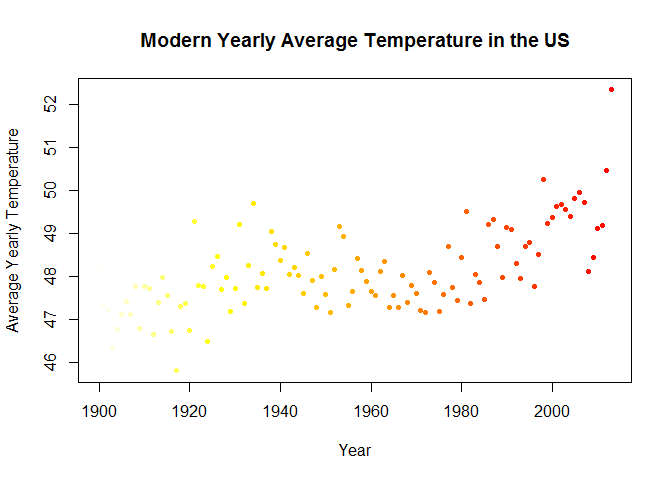

# Case Study 2, Q4
squazi and Patrick  
April 25 2017  
#Temp Data
## I

```r
#load temp data
temp <- read.csv("C:/Users/esunqua/Documents/R/Case Study 2/TEMP.csv")
str(temp)
```

```
## 'data.frame':	574223 obs. of  4 variables:
##  $ Date                           : Factor w/ 3239 levels "1/1/1900","1/1/1901",..: 1587 1588 1589 1590 1591 1592 1593 1594 1595 1596 ...
##  $ Monthly.AverageTemp            : num  13 NA 23.9 26.9 24.9 ...
##  $ Monthly.AverageTemp.Uncertainty: num  2.59 NA 2.51 2.88 2.99 ...
##  $ Country                        : Factor w/ 242 levels "Afghanistan",..: 1 1 1 1 1 1 1 1 1 1 ...
```

```r
head(temp)
```

```
##         Date Monthly.AverageTemp Monthly.AverageTemp.Uncertainty
## 1 1838-04-01              13.008                           2.586
## 2 1838-05-01                  NA                              NA
## 3 1838-06-01              23.950                           2.510
## 4 1838-07-01              26.877                           2.883
## 5 1838-08-01              24.938                           2.992
## 6 1838-09-01              18.981                           2.538
##       Country
## 1 Afghanistan
## 2 Afghanistan
## 3 Afghanistan
## 4 Afghanistan
## 5 Afghanistan
## 6 Afghanistan
```

```r
#Observation- data is monthly temperatures for each country for 3 to 4 centuries
```
###Find the difference between thde maximum and the minimum monthly average temperatures for each country and report/visualize top 20 countries with the maximum differences for the period since 1900.

####We need to get first get rid of all the pre-1900 values by subsetting

```r
#Observation: dates are in all sorts of different formats, but the dates that I want (the 1900+ dates) have "/" instead of "-"
temp$Date2 <-as.character(temp$Date)
substring="/"
tempSub <-subset(temp, grepl(substring,temp$Date2))
tempSub$Date3 <-as.Date(tempSub$Date, format = "%m/%d/%Y")
head(tempSub)
```

```
##         Date Monthly.AverageTemp Monthly.AverageTemp.Uncertainty
## 742 1/1/1900              -3.428                           0.936
## 743 2/1/1900               1.234                           1.135
## 744 3/1/1900              10.545                           0.933
## 745 4/1/1900              13.352                           0.536
## 746 5/1/1900              20.260                           0.524
## 747 6/1/1900              24.448                           0.944
##         Country    Date2      Date3
## 742 Afghanistan 1/1/1900 1900-01-01
## 743 Afghanistan 2/1/1900 1900-02-01
## 744 Afghanistan 3/1/1900 1900-03-01
## 745 Afghanistan 4/1/1900 1900-04-01
## 746 Afghanistan 5/1/1900 1900-05-01
## 747 Afghanistan 6/1/1900 1900-06-01
```
####Now we need to get the maximum and minimum monthly values for each country.

```r
#Get rid of NA values, because they won't contribute to the min or max
library(plyr)
```

```
## Warning: package 'plyr' was built under R version 3.3.3
```

```r
tempClean <-subset(x=tempSub,  !is.na(Monthly.AverageTemp))
#Get the mins and max per country
x <-ddply(tempClean, c("tempClean$Country"), function(x) summary(x$Monthly.AverageTemp))
#Create a new variable that has teh difference between the max an min temperatures per country
x["Difference"] <- x$Max.-x$Min.
#Sort the new difference variable in ascending order
xSort <-arrange(x,desc(Difference))
```
###Report the Top 20 countries with the largest range in monthly temperatures:

```r
xSort$Country <-xSort$'tempClean$Country'
Ifinal <-print(xSort[("1":"20"), c("Country", "Max.", "Min.", "Difference")])
```

```
##         Country   Max.    Min. Difference
## 1    Kazakhstan 25.560 -23.600     49.160
## 2      Mongolia 20.720 -27.290     48.010
## 3        Russia 16.890 -29.790     46.680
## 4        Canada 14.800 -28.740     43.540
## 5    Uzbekistan 30.380 -12.320     42.700
## 6  Turkmenistan 32.140  -8.443     40.583
## 7       Belarus 22.810 -16.530     39.340
## 8       Finland 18.970 -20.100     39.070
## 9       Estonia 22.330 -16.480     38.810
## 10      Ukraine 23.940 -14.720     38.660
## 11   Kyrgyzstan 19.270 -19.160     38.430
## 12  North Korea 23.950 -14.390     38.340
## 13       Latvia 22.280 -15.780     38.060
## 14      Moldova 25.230 -12.780     38.010
## 15    Greenland  0.339 -37.180     37.519
## 16      Denmark  0.699 -36.440     37.139
## 17    Lithuania 21.790 -15.180     36.970
## 18   Tajikistan 19.360 -16.470     35.830
## 19       Poland 22.510 -13.110     35.620
## 20      Armenia 25.290  -9.982     35.272
```
###Visualize the Top 20 countries with the largest range in monthly temperatures:

```r
Ifinal$Country <-as.character(Ifinal$Country)
country <-Ifinal$Country
Difference <-Ifinal$Difference
counts <-table(rep(country, Difference))
barplot(counts, main="Top 20 Countries with the Highest Temperature Difference",col = rainbow(20), ylim=c(0,50), ylab="Diff of Monthly Avg. Temps.", las=2)
```

<!-- -->
##II
###Select a subset of data called "UStemp" where US land temperatures from 01/01/1990 in Temp data. Use UStemp dataset to answer the followings.

```r
tempClean$Country <-as.character(tempClean$Country)
UStemp <-subset(tempClean,subset = (Country == "United States"))
```
###a) Create a new column to display the monthly average land temperatures in Fahrenheit (°F).

```r
UStemp$Fahrenheit <- (UStemp$Monthly.AverageTemp*1.8)+32
```
###b) Calculate average land temperature by year and plot it. The original file has the average land temperature by month.

```r
#tidy up UStemp
UStemp$Date <-UStemp$Date3
UStemp <-subset(UStemp, select = -Date2)
UStemp <-subset(UStemp, select = -Date3)
UStemp$Year<-format(UStemp$Date,'%Y')
ii <-ddply(UStemp, c("Year"), function(x) mean(x$Fahrenheit))
```
####Scatter Plot Method

```r
year = ii$Year       
average = ii$V1         
plot(year, average, main ="Modern Yearly Average Temperature in the US", 
   xlab="Year",       
   ylab="Average Yearly Temperature", pch = 20, col=rev(heat.colors(114)))
```

<!-- -->
####Boxplot

```r
UStemp$Y2 <-as.numeric(UStemp$Year)
UStemp$Decade <-(UStemp$Y2 - (UStemp$Y2 %% 10))
boxplot(UStemp$Fahrenheit~UStemp$Decade, las = 2, xlab="Decade", main ="Average Temperature in the US", col=rev(heat.colors(12)))
```

<!-- -->
###c) Calculate the one year difference of average land temperature by year and provide the maximum difference (value) with corresponding years.

```r
change <-diff(ii$V1)
change <-c(0,change)
ii$Change <-change
summary(ii$Change)
```

```
##     Min.  1st Qu.   Median     Mean  3rd Qu.     Max. 
## -2.12800 -0.42800 -0.02003  0.03593  0.63410  2.54000
```
##iii
### Download "CityTemp" data set (check your SMU email). Find the difference between the maximum and the minimum temperatures for each major city and report/visualize top 20 cities with maximum differences for the period since 1900.

```r
citytemp <-read.csv("C:/Users/esunqua/Documents/R/Case Study 2/CityTemp.csv")
str(citytemp)
```

```
## 'data.frame':	237200 obs. of  7 variables:
##  $ Date                           : Factor w/ 3239 levels "1/1/1900","1/1/1901",..: 1728 1729 1730 1731 1732 1733 1734 1735 1736 1737 ...
##  $ Monthly.AverageTemp            : num  16 18.3 18.6 18.2 17.5 ...
##  $ Monthly.AverageTemp.Uncertainty: num  1.54 1.53 2.16 1.69 1.24 ...
##  $ City                           : Factor w/ 99 levels "Addis Abeba",..: 1 1 1 1 1 1 1 1 1 1 ...
##  $ Country                        : Factor w/ 48 levels "Afghanistan",..: 14 14 14 14 14 14 14 14 14 14 ...
##  $ Latitude                       : Factor w/ 49 levels "0.80N","0.80S",..: 48 48 48 48 48 48 48 48 48 48 ...
##  $ Longitude                      : Factor w/ 92 levels "0.00W","103.66E",..: 48 48 48 48 48 48 48 48 48 48 ...
```

```r
#Dates are factors again
citytemp$D2 <-as.character(citytemp$Date)
CitySub <-subset(citytemp, grepl(substring,citytemp$D2))
CitySumm <-ddply(CitySub, c("CitySub$City"), function(x) summary(CitySub$Monthly.AverageTemp))
CityClean <-subset(x=CitySub,  !is.na(Monthly.AverageTemp))
CitySumm <-ddply(CityClean, c("CityClean$City"), function(x) summary(x$Monthly.AverageTemp))
CitySumm$diff <-CitySumm$Max.-CitySumm$Min.
CitySumm <-arrange(CitySumm,desc(diff))
CitySumm$City <-CitySumm$`CityClean$City`
iii <-print(CitySumm[("1":"20"), c("City", "Max.", "Min.", "diff")])
```

```
##                City  Max.    Min.   diff
## 1            Harbin 26.51 -26.770 53.280
## 2         Changchun 26.57 -23.270 49.840
## 3            Moscow 24.58 -19.380 43.960
## 4          Shenyang 26.01 -17.040 43.050
## 5          Montreal 23.06 -18.360 41.420
## 6              Kiev 24.59 -16.190 40.780
## 7  Saint Petersburg 21.92 -18.590 40.510
## 8           Toronto 23.18 -15.500 38.680
## 9           Taiyuan 24.72 -13.120 37.840
## 10           Peking 28.94  -8.017 36.957
## 11          Tianjin 28.94  -8.017 36.957
## 12            Seoul 26.79  -8.992 35.782
## 13          Mashhad 27.23  -8.384 35.614
## 14           Dalian 25.88  -9.348 35.228
## 15          Chicago 26.37  -8.590 34.960
## 16         Tangshan 27.35  -7.487 34.837
## 17         New York 25.31  -9.147 34.457
## 18          Baghdad 38.28   4.236 34.044
## 19           Berlin 23.80 -10.120 33.920
## 20            Jinan 28.39  -5.389 33.779
```

```r
cit <-as.character(iii$City)
dif <-iii$diff
counts2 <-table(rep(cit, dif))
barplot(counts2, main="Top 20 Cities with the Highest Temperature Difference",col = rainbow(20), ylim=c(0,55), ylab="Diff of Monthly Avg. Temps.", las=2)
```

<!-- -->
###(iv) Compare the two graphs in (i) and (iii) and comment it.

```r
par (mfrow=c(1,2))
barplot(counts, main="Countries",col = rainbow(20), ylim=c(0,60), ylab="Diff of Monthly Avg. Temps.", las=2)
barplot(counts2, main="Cities",col = rainbow(20), ylim=c(0,60), ylab="Diff of Monthly Avg. Temps.", las=2)
```

<!-- -->

```r
#this is an interesting comment
```
