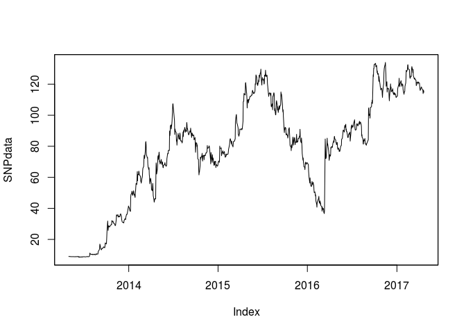
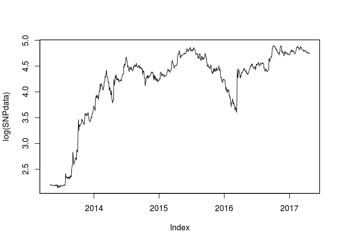
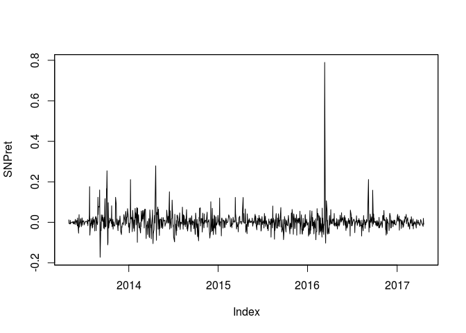
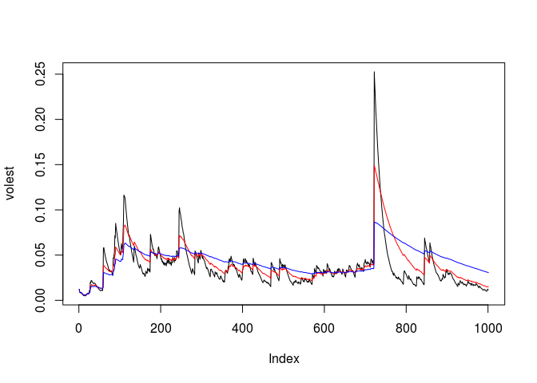
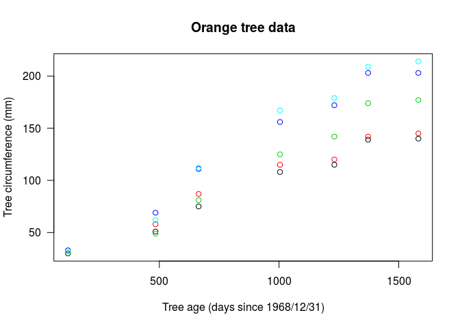
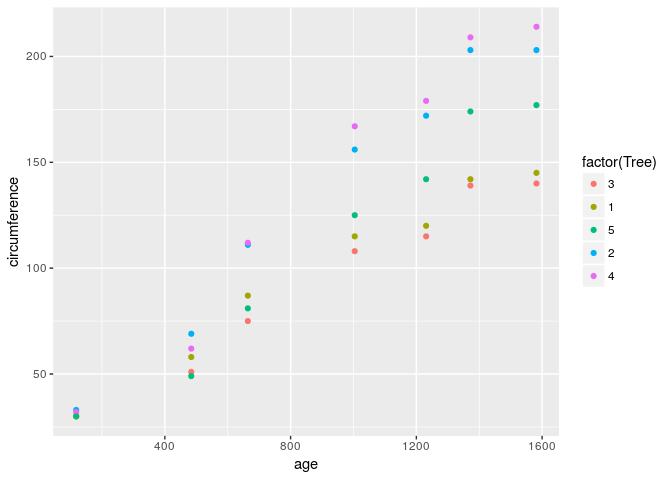
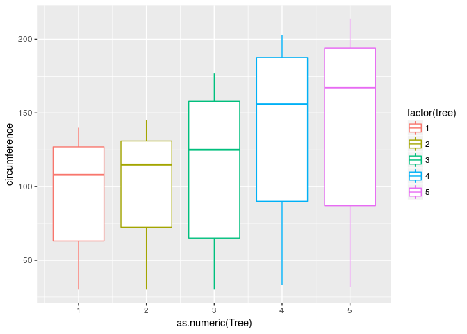
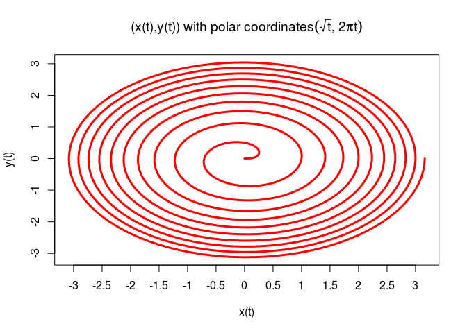

**Case Study 2**
----------------

------------------------------------------------------------------------

### **Question 01**

Create the X matrix and print it from SAS, R, and Python.

        [4 5 12]
    X = [1 0 35]
        [2 1 82]

    # ...   -=-=-=-=-=-=-=-=-=-=-=-=-=-=-=-=-=-=-=-=-=-=-=-=-=-=-=-=-=-=-=-=-=-=-=-=-
    # ...   in R, 1st as a data frame and 2nd as a matrix
    # ...   -=-=-=-=-=-=-=-=-=-=-=-=-=-=-=-=-=-=-=-=-=-=-=-=-=-=-=-=-=-=-=-=-=-=-=-=-

        x1 <- c(4, 5, 12)
        x2 <- c(1, 0 , 35)
        x3 <- c(3, 1, 82)
        df_X <- rbind.data.frame(x1, x2, x3)
        names(df_X) <- c("c1", "c2", "c3")
        df_X

    ##   c1 c2 c3
    ## 1  4  5 12
    ## 2  1  0 35
    ## 3  3  1 82

        A = matrix( 
            c(4, 5, 12, 1, 0, 35, 3, 1, 82), # the data elements 
            nrow = 3,              # number of rows 
            ncol = 3,              # number of columns 
            byrow = TRUE)        # fill matrix by rows 
        A

    ##      [,1] [,2] [,3]
    ## [1,]    4    5   12
    ## [2,]    1    0   35
    ## [3,]    3    1   82

    # ...   -=-=-=-=-=-=-=-=-=-=-=-=-=-=-=-=-=-=-=-=-=-=-=-=-=-=-=-=-=-=-=-=-=-=-=-=-
    # ...   Need SAS code and image here
    # ...   -=-=-=-=-=-=-=-=-=-=-=-=-=-=-=-=-=-=-=-=-=-=-=-=-=-=-=-=-=-=-=-=-=-=-=-=-

        
    # ...   -=-=-=-=-=-=-=-=-=-=-=-=-=-=-=-=-=-=-=-=-=-=-=-=-=-=-=-=-=-=-=-=-=-=-=-=-
    # ...   Need python code and output here
    # ...   -=-=-=-=-=-=-=-=-=-=-=-=-=-=-=-=-=-=-=-=-=-=-=-=-=-=-=-=-=-=-=-=-=-=-=-=-

------------------------------------------------------------------------

### **Question 02**

Please watch videos1 and 2 in week 11 lecture assignment. You can
download the code which used for S&P from files tab.  
Please do the following with your assigned stock.  
 Download the data.  
 Calculate log returns.  
 Calculate volatility measure.  
 Calculate volatility over entire length of series for various three
different decay factors.  
 Plot the results, overlaying the volatility curves on the data, just
as was done in the S&P example.

<table>
<thead>
<tr class="header">
<th>Group</th>
<th>Stock</th>
</tr>
</thead>
<tbody>
<tr class="odd">
<td>Patrick &amp; Sunna</td>
<td>GWPH</td>
</tr>
</tbody>
</table>

    # ...   -=-=-=-=-=-=-=-=-=-=-=-=-=-=-=-=-=-=-=-=-=-=-=-=-=-=-=-=-=-=-=-=-=-=-=-=-
    # ...   -=-=-=-=-=-=-=-=-=-=-=-=-=-=-=-=-=-=-=-=-=-=-=-=-=-=-=-=-=-=-=-=-=-=-=-=-

    library(tseries)

    # ...   -=-=-=-=-=-=-=-=-=-=-=-=-=-=-=-=-=-=-=-=-=-=-=-=-=-=-=-=-=-=-=-=-=-=-=-=-
    # ..     volatility function
    # ...   -=-=-=-=-=-=-=-=-=-=-=-=-=-=-=-=-=-=-=-=-=-=-=-=-=-=-=-=-=-=-=-=-=-=-=-=-

    getVol <- function(d, logrets)
    {
        var = 0
        lam = 0
        varlist <- c()

        for (r in logrets)
        {
            lam = lam*(1 - 1/d) + 1
            var = (1 - 1/lam)*var + (1/lam)*r^2
            varlist <- c(varlist, var)
        }
        sqrt(varlist)
    }

    # ...   -=-=-=-=-=-=-=-=-=-=-=-=-=-=-=-=-=-=-=-=-=-=-=-=-=-=-=-=-=-=-=-=-=-=-=-=-
    # ...   
    # ...   -=-=-=-=-=-=-=-=-=-=-=-=-=-=-=-=-=-=-=-=-=-=-=-=-=-=-=-=-=-=-=-=-=-=-=-=-

        SNPdata <- get.hist.quote('gwph', quote = "Close")

    ## time series starts 2013-05-01
    ## time series ends   2017-04-21

        SNPret <- log(lag(SNPdata)) - log(SNPdata)
        SNPvol <- sd(SNPret) * sqrt(250) * 100

    # ...   -=-=-=-=-=-=-=-=-=-=-=-=-=-=-=-=-=-=-=-=-=-=-=-=-=-=-=-=-=-=-=-=-=-=-=-=-
    # ...   recreate figure 6.12 in the text on page 155
    # ...   -=-=-=-=-=-=-=-=-=-=-=-=-=-=-=-=-=-=-=-=-=-=-=-=-=-=-=-=-=-=-=-=-=-=-=-=-

        volest  <- getVol(10, SNPret)
        volest2 <- getVol(30, SNPret)
        volest3 <- getVol(100, SNPret)
        
        plot(SNPdata)

        plot(log(SNPdata))

        plot(SNPret)

        plot(volest, type = "l")
        lines(volest2, type = "l", col = "red")
        lines(volest3, type = "l", col = "blue")

------------------------------------------------------------------------

### **Question 03**

The built-in data set called Orange in R is about the growth of orange
trees. The Orange data frame has 3 columns of records of the growth of
orange trees.  
Variable description  
\* Tree : an ordered factor indicating the tree on which the measurement
is made. The ordering is according to increasing maximum diameter.  
\* age : a numeric vector giving the age of the tree (days since
1968/12/31)  
\* circumference : a numeric vector of trunk circumferences (mm). This
is probably “circumference at breast height”, a standard measurement in
forestry.

Submit your final R code and necessary plots for each part.

    data (Orange)

    # ...   -=-=-=-=-=-=-=-=-=-=-=-=-=-=-=-=-=-=-=-=-=-=-=-=-=-=-=-=-=-=-=-=-=-=-=-=-
    # ...   a) Calculate the mean and the median of the trunk circumferences
    # ...       for different size of the trees. (Tree)  
    # ...   -=-=-=-=-=-=-=-=-=-=-=-=-=-=-=-=-=-=-=-=-=-=-=-=-=-=-=-=-=-=-=-=-=-=-=-=-

    col_drops <- c("age", "tree")
    df_orange_tmp <- Orange[ , !(names(Orange) %in% col_drops)]
    aggregate(df_orange_tmp[, 2], list(df_orange_tmp$Tree), mean)

    ##   Group.1         x
    ## 1       3  94.00000
    ## 2       1  99.57143
    ## 3       5 111.14286
    ## 4       2 135.28571
    ## 5       4 139.28571

    aggregate(df_orange_tmp[, 2], list(df_orange_tmp$Tree), median)

    ##   Group.1   x
    ## 1       3 108
    ## 2       1 115
    ## 3       5 125
    ## 4       2 156
    ## 5       4 167

    # ...   -=-=-=-=-=-=-=-=-=-=-=-=-=-=-=-=-=-=-=-=-=-=-=-=-=-=-=-=-=-=-=-=-=-=-=-=-
    # ...b) Make a scatter plot of the trunk circumferences against the age of the tree.
    # ...   Use different plotting symbols for different size of trees.  
    # ...   -=-=-=-=-=-=-=-=-=-=-=-=-=-=-=-=-=-=-=-=-=-=-=-=-=-=-=-=-=-=-=-=-=-=-=-=-

        plot(circumference ~ age, data = Orange,
            xlab = "Tree age (days since 1968/12/31)",
            ylab = "Tree circumference (mm)", las = 1,
            main = "Orange tree data",
            col = Tree)

        p <- ggplot(Orange, aes(age, circumference))
        p + geom_point(aes(color = factor(Tree)))

    # ...   -=-=-=-=-=-=-=-=-=-=-=-=-=-=-=-=-=-=-=-=-=-=-=-=-=-=-=-=-=-=-=-=-=-=-=-=-
    # ...   c) Display the trunk circumferences on a comparative boxplot against tree.
    # ...   Be sure you order the boxplots in the increasing order of maximum diameter.  
    # ...   -=-=-=-=-=-=-=-=-=-=-=-=-=-=-=-=-=-=-=-=-=-=-=-=-=-=-=-=-=-=-=-=-=-=-=-=-

        Orange$tree <- as.numeric(Orange$Tree)

        p <- ggplot(Orange, aes(x = as.numeric(Tree), y = circumference))
        p + geom_boxplot(aes(color = factor(tree)))

------------------------------------------------------------------------

### **Question 04**

Download “Temp” data set (check your SMU email)

1.  Find the difference between the maximum and the minimum monthly
    average temperatures for each country and report/visualize top 20
    countries with the maximum differences for the period since 1900.

2.  Select a subset of data called “UStemp” where US land temperatures
    from 01/01/1990 in Temp data. Use UStemp dataset to answer
    the followings.

    1.  Create a new column to display the monthly average land
        temperatures in Fahrenheit ( °F) .  
    2.  Calculate average land temperature by year and plot it. The
        original file has the average land temperature by month.  
    3.  Calculate the one year difference of average land temperature by
        year and provide the maximum difference (value) with
        corresponding years.  
        (for example, year 2000: add all 12 monthly averages and divide
        by 12 to get average temperature in 2000. You can do the same
        thing for all the available years. Then you can calculate the
        one year difference as 1991-1990, 1992- 1991, etc)

3.  Download “CityTemp” data set (check your SMU email). Find the
    difference between the maximum and the minimum temperatures for each
    major city and report/visualize top 20 cities with maximum
    differences for the period since 1900.

4.  Compare the two graphs in (i) and (iii) and comment it. You can use
    either R or Python

<!-- -->

    # ...   -=-=-=-=-=-=-=-=-=-=-=-=-=-=-=-=-=-=-=-=-=-=-=-=-=-=-=-=-=-=-=-=-=-=-=-=-
    # ...       Question 4 needs to be complete
    # ...   -=-=-=-=-=-=-=-=-=-=-=-=-=-=-=-=-=-=-=-=-=-=-=-=-=-=-=-=-=-=-=-=-=-=-=-=-

    # ...   -=-=-=-=-=-=-=-=-=-=-=-=-=-=-=-=-=-=-=-=-=-=-=-=-=-=-=-=-=-=-=-=-=-=-=-=-
    # ...       import data sets
    # ...   -=-=-=-=-=-=-=-=-=-=-=-=-=-=-=-=-=-=-=-=-=-=-=-=-=-=-=-=-=-=-=-=-=-=-=-=-

        setwd(data_dir)
        temps <- read.csv (file = "TEMP.csv", stringsAsFactors = FALSE)
        city_temp <- read.csv (file = "CityTemp.csv", stringsAsFactors = FALSE)
        setwd(home_dir)

        
    # ...   -=-=-=-=-=-=-=-=-=-=-=-=-=-=-=-=-=-=-=-=-=-=-=-=-=-=-=-=-=-=-=-=-=-=-=-=-
    # ...       all the rest of q4 answers here ....
    # ...   -=-=-=-=-=-=-=-=-=-=-=-=-=-=-=-=-=-=-=-=-=-=-=-=-=-=-=-=-=-=-=-=-=-=-=-=-

------------------------------------------------------------------------

### **... Question 05**

##### ... Semester End Bonus

##### ... Run the following code in R and paste the final graph.

    # ...   -=-=-=-=-=-=-=-=-=-=-=-=-=-=-=-=-=-=-=-=-=-=-=-=-=-=-=-=-=-=-=-=-=-=-=-=-
    # ...   -=-=-=-=-=-=-=-=-=-=-=-=-=-=-=-=-=-=-=-=-=-=-=-=-=-=-=-=-=-=-=-=-=-=-=-=-

        t<-seq(0,10,length=1000)
        x<-sqrt(t)*cos(2*pi*t)
        y<-sqrt(t)*sin(2*pi*t)
        
        plot(x,y,axes=F,type="l",lwd=3,xlab="x(t)",ylab="y(t)",col="red")
        axis(1,at=seq(-3,3,by=0.5),labels=seq(-3,3,by=0.5))
        axis(2)
        
        box()
        
        title(main=expression(
        paste("(x(t),y(t)) with polar coordinates",
        (list(sqrt(t),2*pi*t))
        )))

